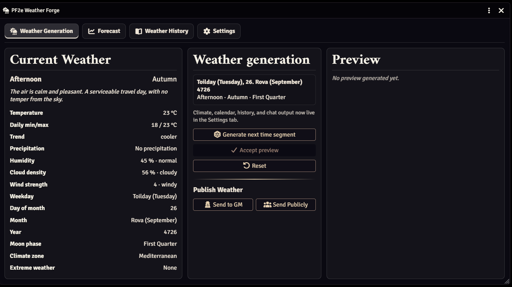
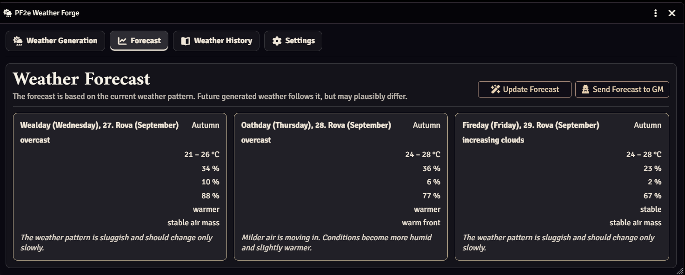
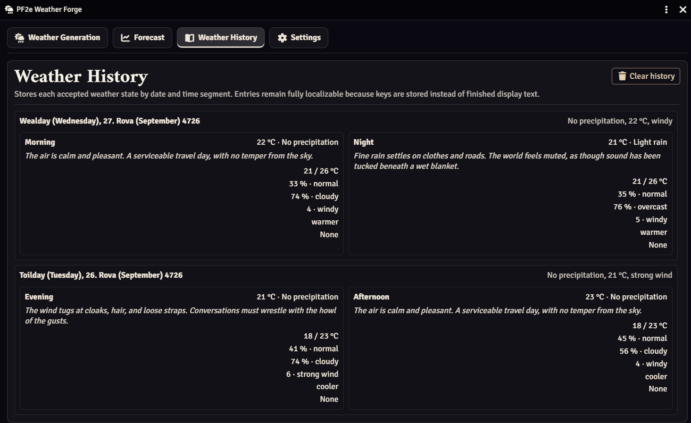

# PF2E Weather Forge

A weather, forecast and calendar system for Pathfinder Second Edition Remastered on Foundry Virtual Tabletop.

PF2E Weather Forge provides persistent weather generation, an integrated Golarion calendar, weather history, forecasting, climate zones, extreme weather events and chat integration without requiring external calendar modules.


## Main Window






## Features

### Weather Generation

* Persistent weather system
* Realistic temperature progression throughout the day
* Climate-based weather generation
* Seasonal temperature ranges
* Humidity, cloud cover and wind strength
* Localized weather descriptions
* Extreme weather events
* Multi-stage weather systems

### Calendar Forge

Built-in Golarion calendar including:

* Weekday
* Day of month
* Month
* Year
* Season
* Moon phase
* Time of day

Supported times of day:

* Morning
* Noon
* Afternoon
* Evening
* Night

### Forecast System

Generate weather forecasts based on actual weather trends.

* 1 / 3 / 5 / 7 day forecasts
* Temperature ranges
* Rain probability
* Storm probability
* Confidence indicator
* Forecasts influence future weather generation

### Weather History

Track historical weather data.

* Weather history by date
* Time-of-day entries
* Configurable history limits
* Historical weather review

### Climate Zones

Supported climate zones:

* Arctic
* Temperate
* Mediterranean
* Tropical
* Desert
* Mountain
* Coastal
* Swamp

### Chat Integration

Publish weather reports directly to chat.

* GM-only weather reports
* Public weather reports
* Forecast reports
* Localized chat cards

### Localization

Included translations:

* English
* German

## User Interface

The Weather Forge interface is divided into four tabs:

### Weather

Current weather conditions and generation controls.

### Forecast

Weather forecasts and weather trend information.

### History

Historical weather records.

### Settings

Climate zones, history settings, calendar controls and weather options.

## Installation

### Manifest URL

Add the manifest URL in Foundry's Install Module dialog.

```text
<manifest-url>
```

### Manual Installation

1. Download the latest release.
2. Extract the ZIP into:

```text
FoundryVTT/Data/modules/
```

3. Enable PF2E Weather Forge in your world.

## Compatibility

* Foundry VTT V14
* Pathfinder 2E Remastered

## License

MIT License

## Credits

Created for Pathfinder 2E Remastered and Foundry VTT.
